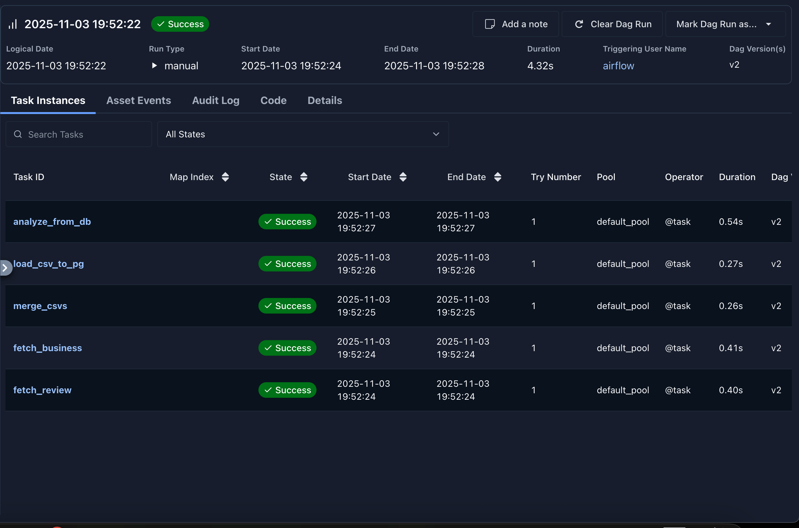
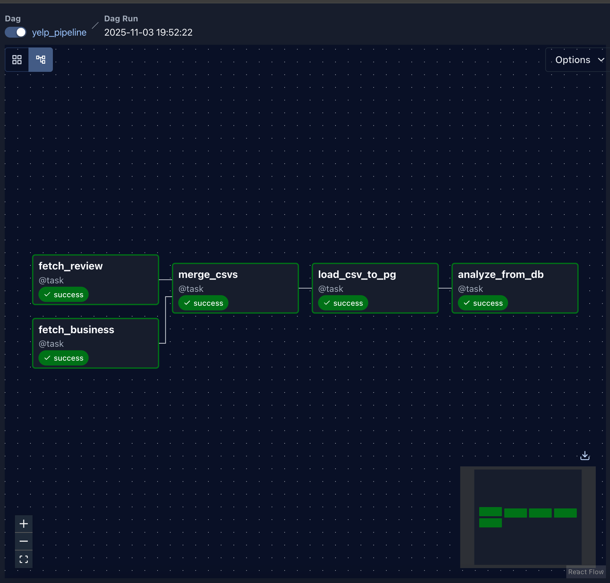
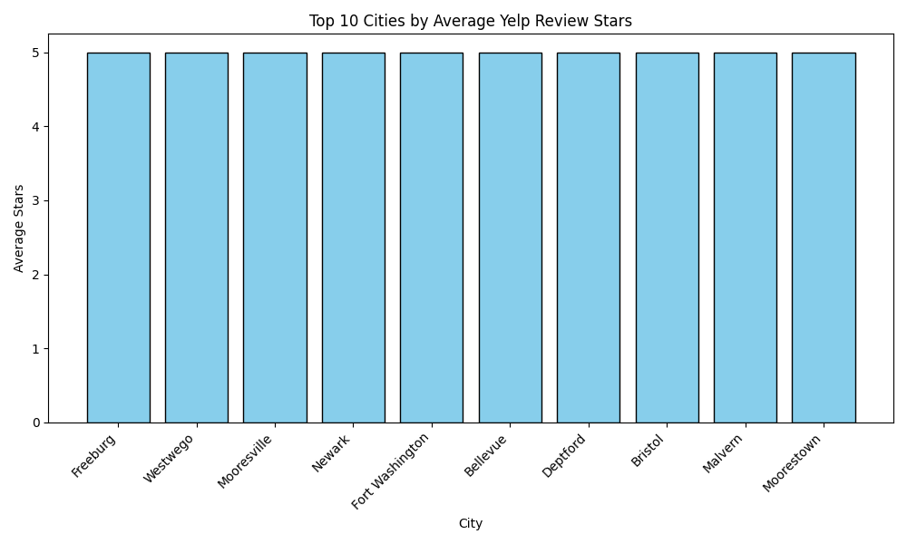

# Yelp Data Pipeline with Apache Airflow

This project demonstrates a complete ETL and analysis pipeline orchestrated with Apache Airflow.
The pipeline extracts, transforms, and loads Yelp datasets into PostgreSQL, performs an analysis, generates a visualization, and cleans up intermediate files, all running inside Docker.

---

## Project Structure

Data source: https://www.kaggle.com/datasets/adamamer2001/yelp-complete-open-dataset-2024

```
airflow-pg/
├── dags/
│   └── pipeline.py             # Main Airflow DAG
├── data/
│   ├── raw/                    # Original Yelp JSON files
│   ├── intermediate/           # Temporary CSV files (auto-cleaned)
│   └── outputs/                # Final analysis outputs (for plots)
├── .devcontainer/
│   ├── docker-compose.yml      # Airflow, Postgres, and Redis setup
│   └── db.env                  # Database environment variables
├── requirements.txt            # Python dependencies
└── README.md                   # Project documentation
```

---

## Pipeline Overview

**DAG ID:** `yelp_pipeline`

| Step | Task                      | Description                                                                              |
| ---- | ------------------------- | ---------------------------------------------------------------------------------------- |
| 1    | fetch_business            | Reads 5,000 sample rows from `yelp_academic_dataset_business.json` and writes a CSV file |
| 2    | fetch_review              | Reads 5,000 sample rows from `yelp_academic_dataset_review.json` and writes a CSV file   |
| 3    | merge_csvs                | Merges business and review samples on `business_id`                                      |
| 4    | load_csv_to_pg            | Loads merged data into PostgreSQL table `week10_assignment.yelp_merged`                  |
| 5    | analyze_from_db           | Runs an SQL query to compute average ratings per city and generates a visualization      |
| 6    | clear_intermediate_folder | Deletes all temporary CSVs and intermediate files                                        |

---

## Analysis Output

After the pipeline runs successfully, a visualization is generated under:

```
/opt/airflow/data/outputs/avg_stars_by_city.png
```

It shows the top 10 cities by average Yelp review stars based on the sample dataset.

Example output:

Top 10 Cities by Average Yelp Review Stars

---

## Running the Project

1. **Build and start containers**

   ```bash
   cd .devcontainer
   docker compose build --no-cache
   docker compose up -d
   ```

2. **Access Airflow UI**

   ```
   http://localhost:8080
   ```

   Default credentials:
   Username: `airflow`
   Password: `airflow`

3. **Trigger the DAG**

   * Enable and run `yelp_pipeline` from the Airflow dashboard.
   * Check task logs for progress and SQL results.

4. **View results**

   * Final visualization is saved in `data/outputs/avg_stars_by_city.png`
   * Intermediate CSVs are automatically deleted.

---

## Technologies Used

* Apache Airflow for orchestration and scheduling
* PostgreSQL for data storage
* Matplotlib for visualization
* Docker for containerization

---
Screenshots

1. Successful DAG Execution in Airflow UI


2. DAG Graph View  
   

3. Visualization Output (avg_stars_by_city)  
   


---
## Cleanup

All intermediate files under `/opt/airflow/data/intermediate` are deleted automatically by the final cleanup task.
Only the raw input files and final visualization are kept.

---